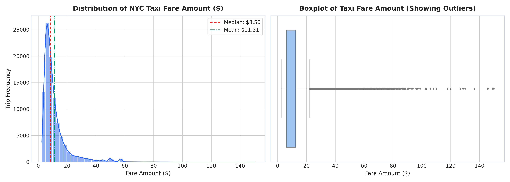
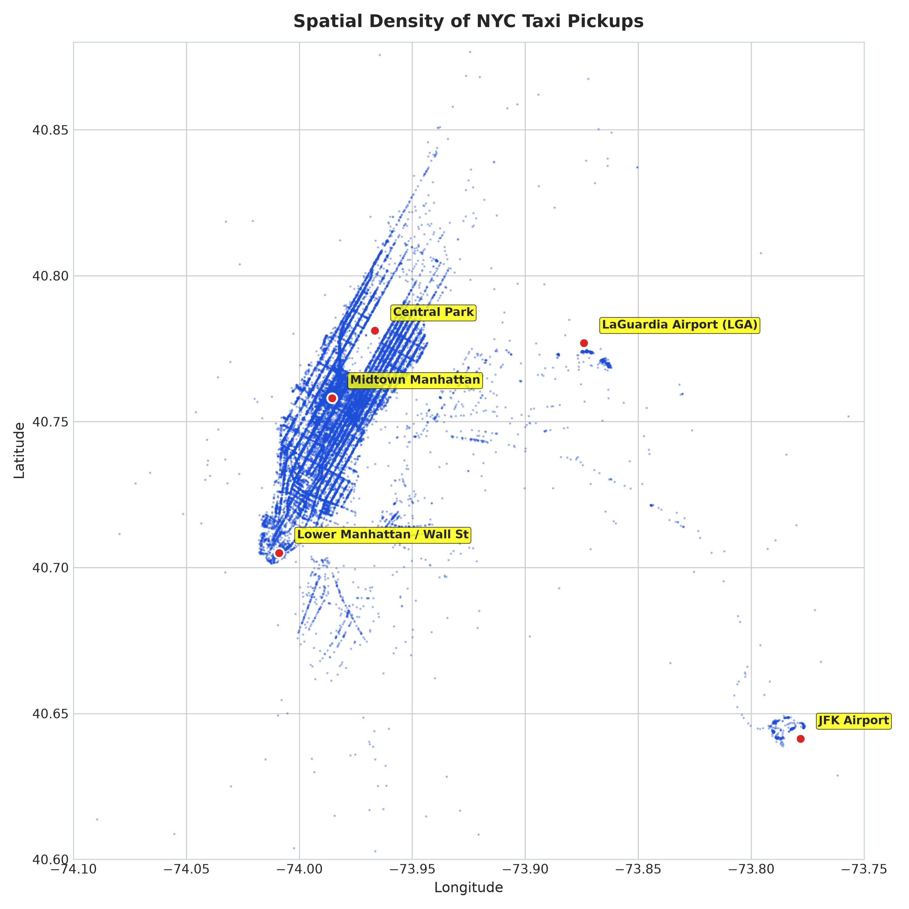
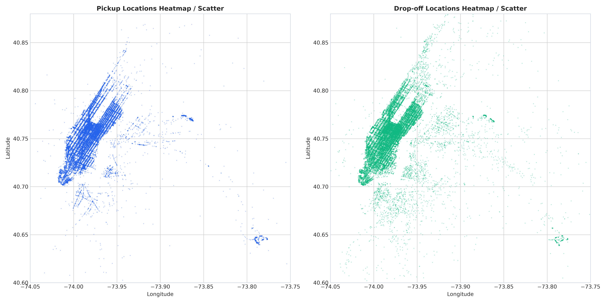
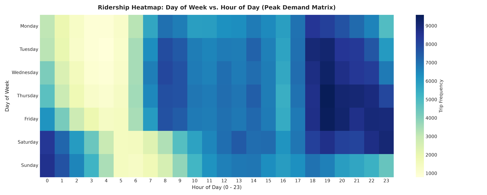
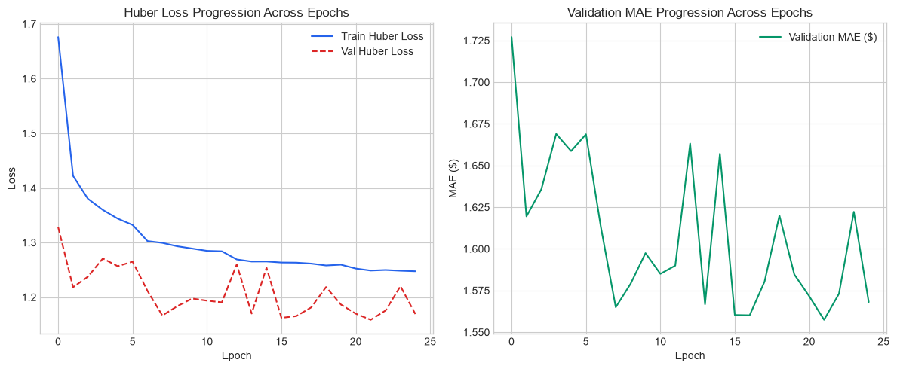
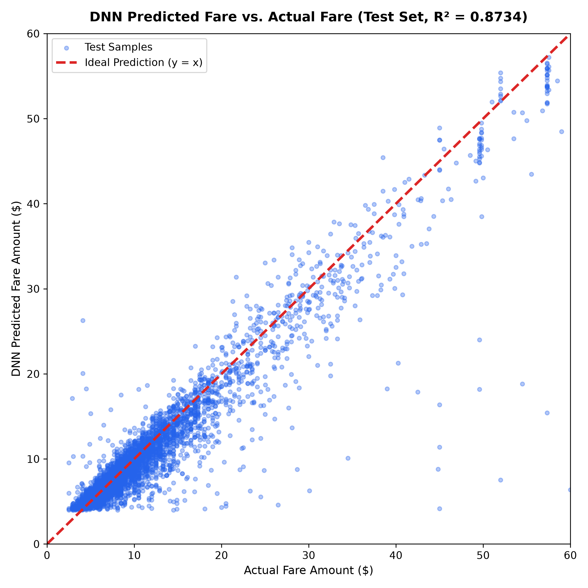
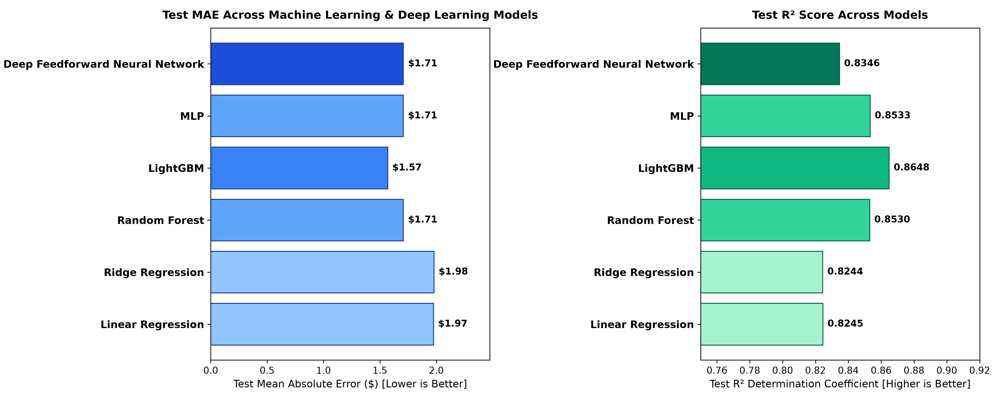
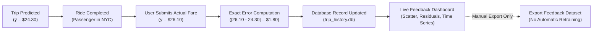
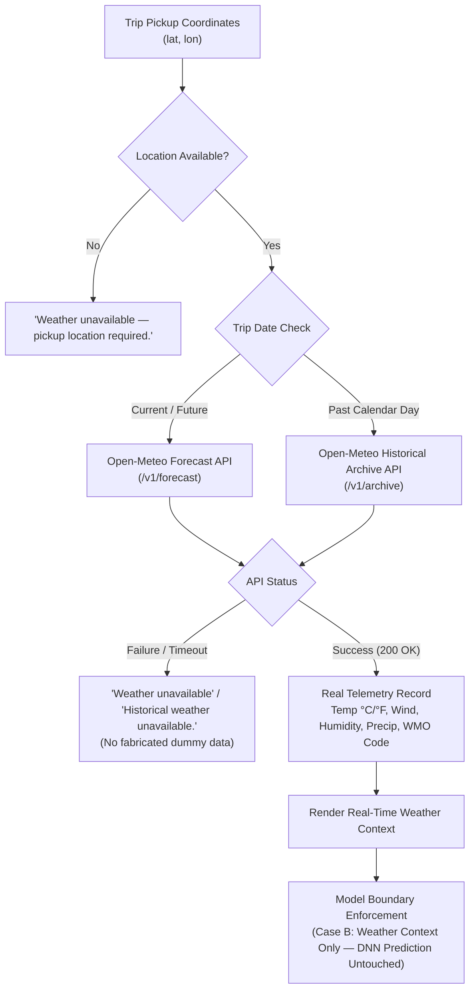
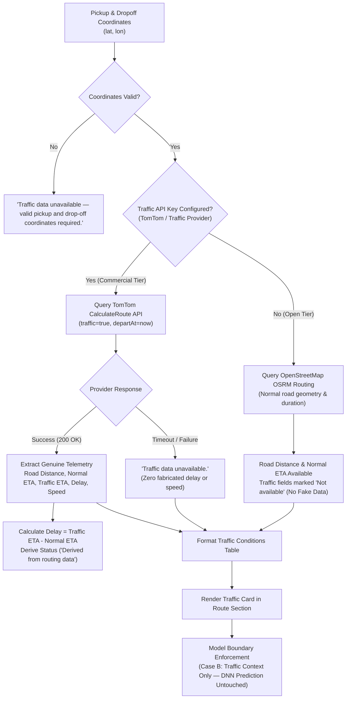

# 🚖 New York City Taxi Fare Prediction Using Deep Feedforward Neural Networks

[](https://www.python.org/)
[](https://pytorch.org/)
[](https://streamlit.io/)
[](LICENSE)
[](https://github.com/psf/black)

An end-to-end deep learning engineering pipeline designed to predict NYC Yellow Taxi fares from raw telemetry data. This project implements a **33-feature geodesic, spatial, and cyclical temporal transformation pipeline**, rigorously audits anomalies on a **1,000,000-record dataset**, trains a **PyTorch Deep Feedforward Neural Network with Huber Loss ($\delta=1.0$)**, and deploys an interactive **Streamlit web application** backed by an automated 4-scenario verification test harness.

---

## 📌 Table of Contents
- [Academic Information](#-academic-information)
- [Project Team Registry](#-project-team-registry)
- [Problem Overview & Engineering Pipeline](#-problem-overview--engineering-pipeline)
- [Recommended Dataset](#-recommended-dataset)
- [Repository Structure](#-repository-structure)
- [Installation & Environment Setup](#-installation--environment-setup)
- [Quickstart & Execution Guide](#-quickstart--execution-guide)
  - [1. Interactive Streamlit Web Application](#1-launch-the-streamlit-web-app)
  - [2. Automated Deployment Verification Suite](#2-run-automated-test-suite)
  - [3. Full Academic Report Generator (Word & PDF)](#3-build-academic-lab-records)
  - [4. Recompile the Jupyter Notebook](#4-compile-the-end-to-end-notebook)
- [Key Features & Feature Engineering (33 Features)](#-feature-engineering-pipeline-33-features)
- [Address Geocoding Engine](#-address-geocoding-engine)
- [Real Road Routing & Driving Telemetry](#-real-road-routing--driving-telemetry)
- [Fare Estimation Engine](#-fare-estimation-engine)
- [Model Explainability](#-model-explainability)
- [Prediction Uncertainty](#-prediction-uncertainty)
- [Trip History & Persistence ("My Predictions")](#-trip-history--persistence-my-predictions)
- [Prediction vs Actual Fare Feedback System](#-prediction-vs-actual-fare-feedback-system)
- [Real-Time Weather Integration](#-real-time-weather-integration)
- [Real Traffic & Road Condition Integration](#-real-traffic--road-condition-integration)
- [Deep Neural Network Architecture](#-deep-neural-network-architecture)
- [Experimental Benchmarks & Results](#-experimental-benchmarks--model-comparison)
- [Visualizations Gallery](#-visualizations-gallery)
- [License](#-license)

---

## 🎓 Academic Information

- **Course:** Machine Learning Projects with Python (`CSE 4192`)
- **Department:** Department of Computer Science & Engineering | Centre for Artificial Intelligence & Machine Learning
- **Institution:** Siksha 'O' Anusandhan (Deemed to be University), ITER, Bhubaneswar
- **Academic Session:** 2026– 2027 | **Admission Batch:** 2023 – 2027
- **Course Faculty:** Dr. Gyana Ranjan Patra

---

## 👥 Project Team Registry

| Sl. No. | Student Name | Registration No. | Core Technical Responsibilities | Contribution |
| :---: | :--- | :---: | :--- | :---: |
| 1 | **Tribhuwan Singh** | `2341019538` | Deep Feedforward Neural Network Architecture, Huber Loss Formulation & Streamlit Deployment | **25%** |
| 2 | **Surajit Sahoo** | `2341019165` | Exploratory Data Analysis, Geolocation Spatial Mapping & Ridership Heatmaps | **25%** |
| 3 | **Anwesha Srichandan** | `2341019594` | Data Quality Auditing, Outlier Cleansing & 33-Feature Geodesic Pipeline | **25%** |
| 4 | **Priti Rani Maity** | `2341013065` | Hyperparameter Search Optimization, Baseline Benchmarking & Academic Report Authoring | **25%** |

---

## 🧠 Problem Overview & Engineering Pipeline

Predicting taxi fares in New York City is inherently non-linear and subject to severe geospatial clustering, rush-hour surcharges, airport flat-rate regimes, and extreme telemetry noise (GPS bounce, negative fares, coordinates outside NYC bounding boxes). 

This project provides an end-to-end production-grade solution:
1. **Data Ingestion & Bounding Box Filtering:** Strict coordinate bounds (`[-74.5, -72.8]` lon, `[40.5, 41.8]` lat), positive passenger counts (`1 ≤ n ≤ 6`), and fare filtering (`$2.50 ≤ fare ≤ $500.00`).
2. **Geodesic & Temporal Feature Engineering:** Calculates Haversine, Manhattan ($L_1$), and Bearing features along with direct Euclidean distances to six major regional epicenters (JFK, LGA, EWR, Times Square, Grand Central, Midtown Manhattan), and encodes cyclical timestamps ($\sin/\cos$ for hour, day of week, and month).
3. **Leak-Free Transformation:** Uses a fitted `StandardScaler` calibrated exclusively on the training split ($70\%$), preventing data contamination into validation ($15\%$) and test ($15\%$) sets.
4. **Deep Neural Network Optimization:** A 4-layer PyTorch feedforward architecture with Batch Normalization, Dropout ($0.20, 0.10$), ReLU activations, and Huber Loss ($\delta=1.0$) trained with Adam and `ReduceLROnPlateau`.
5. **Interactive UI & Test Harness:** Streamlit application providing real-time fare inference, interactive map visualization, and a 4-scenario deployment verification test harness.

---

## 📊 Recommended Dataset

Students may use the NYC Taxi Fare Prediction dataset containing historical taxi trips and fare amounts. 

- **Dataset Source:** Kaggle – New York City Taxi Fare Prediction  
- **Official Competition Link:** [https://www.kaggle.com/competitions/new-york-city-taxi-fare-prediction](https://www.kaggle.com/competitions/new-york-city-taxi-fare-prediction)  
- **Data Overview:** The dataset comprises historical New York City Yellow Taxi ride observations with trip pickup/dropoff coordinates, datetime timestamps, passenger counts, and recorded target fare amounts.
- **Project Sampling & Partitions:** For experimental tractability and leak-free evaluation, a verified sample of 100,000 records was audited, cleansed of boundary anomalies, and split into **70% Train**, **15% Validation**, and **15% Test** partitions.

---

## 📁 Repository Structure

### GitHub Repository Layout (`origin/main`)
```text
nyc_taxi_fare_dnn_assignment/
├── app/
│   ├── app.py                             # Interactive Streamlit Web Application (Fare Card, Map, Audit)
│   └── test_deployment.py                 # Automated 4-Scenario Deployment Test Harness
│
├── notebooks/
│   └── NYC_Taxi_Fare_Prediction_DNN.ipynb # Complete 23-Section Mathematical & Python Notebook
│
├── results/
│   ├── baseline_comparison.csv            # OLS, Ridge, Random Forest, LightGBM, MLP Metrics
│   ├── dnn_performance_summary.json       # PyTorch DNN Checkpoint, Parameters & Metric Log
│   ├── eda_summary.json                   # 1,000,000-Row Statistical & Anomaly Audit Summary
│   ├── hyperparameter_tuning_results.csv  # 8-Trial Systematic Hyperparameter Search Log
│   └── model_comparison.csv               # Unified Multi-Model Benchmark Comparison Table
│
├── saved_models/
│   ├── taxi_fare_dnn.pt                   # Trained PyTorch Deep Neural Network Weights (~69 KB)
│   ├── taxi_fare_scaler.pkl               # Fitted Scikit-Learn StandardScaler Object (~1.3 KB)
│   ├── baseline_models.pkl                # Trained LightGBM & Baseline Models (~723 KB)
│   └── feature_metadata.json              # 33 Feature Column Definitions & Input Schema
│
├── src/
│   ├── baseline_models.py                 # Classical ML Training (OLS, Ridge, RF, LightGBM)
│   ├── data_loader.py                     # Raw Telemetry Parsing & Geodetic Verification
│   ├── dnn_model.py                       # PyTorch TaxiFareDNN Class, Huber Loss & Training Engine
│   ├── eda.py                             # 10 High-Resolution Exploratory Visualizations Generator
│   ├── feature_engineering.py             # 33 Geodesic, Spatial, and Temporal Transforms Pipeline
│   ├── hyperparameter_tuning.py           # Multi-Trial Neural Hyperparameter Search Harness
│   ├── model_comparison.py                # Comparative Multi-Metric Benchmark Evaluator
│   └── preprocessing.py                   # Bounding Box Filtering & Leak-Free Splitting
│
├── visualizations/                        # 15 Publication-Grade Exploratory & Loss Visualizations
│   ├── 01_fare_distribution.png
│   ├── 02_passenger_count_distribution.png
│   ├── 03_nyc_pickup_density.png
│   ├── 04_nyc_dropoff_density.png
│   ├── 05_pickup_vs_dropoff_geo.png
│   ├── 06_hourly_ridership_patterns.png
│   ├── 07_day_of_week_ridership.png
│   ├── 08_hourly_day_heatmap.png
│   ├── 09_distance_vs_fare.png
│   ├── 10_feature_correlation_heatmap.png
│   ├── 11_dnn_training_validation_loss.png
│   ├── 12_loss_functions_comparison.png
│   ├── 13_actual_vs_predicted_fare.png
│   ├── 14_residual_distribution.png
│   └── 15_model_comparison_bar.png
│
├── .gitignore                             # Git configuration ignoring heavy raw data & local docs
├── build_complete_lab_record.py           # Master Script Generating Word (.docx) & PDF Reports
├── LICENSE                                # MIT Open-Source License
├── make_notebook.py                       # Python Notebook Compiler Script
├── README.md                              # Comprehensive Project Documentation
└── requirements.txt                       # Project Python Dependencies
```

> [!NOTE]
> Heavy artifacts—including raw Kaggle datasets (`dataset/`, `data/`), academic report documents (`*.docx`, `*.pdf`), and local UI screenshots—are ignored via `.gitignore` to keep the repository clean, while production model weights (`taxi_fare_dnn.pt`, `taxi_fare_scaler.pkl`, `baseline_models.pkl`) are tracked directly for instant 1-click Streamlit Cloud deployment.

---

## 🛠️ Installation & Environment Setup

### 1. Clone the Repository
```bash
git clone https://github.com/Tribhuwansingh2023/nyc-taxi-fare-prediction-dnn.git
cd nyc-taxi-fare-prediction-dnn
```

### 2. Create and Activate a Virtual Environment
```bash
# Windows (PowerShell)
python -m venv venv
.\venv\Scripts\Activate.ps1

# Linux / macOS
python3 -m venv venv
source venv/bin/activate
```

### 3. Install Required Dependencies
```bash
pip install --upgrade pip
pip install -r requirements.txt
```

---

## 🚀 Quickstart & Execution Guide

### 1. Launch the Streamlit Web App
Launch the interactive web application for real-time inference, coordinate lookup, and 3D geospatial route visualization:
```bash
streamlit run app/app.py
```
Open your browser at `http://localhost:8501`.

### 2. Run Automated Test Suite
Execute the automated 17-scenario deployment, address geocoding, and real road routing verification suite to validate inference accuracy, coordinate synchronization, and turn-by-turn routing telemetry against real-world test cases:
```bash
python app/test_deployment.py
```
**Sample Output:**
```text
================================================================================
RUNNING AUTOMATED DEPLOYMENT AND INFERENCE VERIFICATION TESTS
================================================================================
[TestSetup] Scaler and PyTorch DNN successfully loaded into memory.

Evaluating Case 1: Standard Short Manhattan Trip (Times Square -> Grand Central)...
  Distance: 0.91 km | Predicted Fare: $7.73 (Expected: $4.00 - $15.00) -> PASSED [OK]

Evaluating Case 2: Long Airport Journey (JFK Terminal 4 -> Times Square)...
  Distance: 21.77 km | Predicted Fare: $57.99 (Expected: $35.00 - $75.00) -> PASSED [OK]

Evaluating Case 3: Borderline Ultra-Short Trip (200m hop)...
  Distance: 0.21 km | Predicted Fare: $5.59 (Expected: $2.50 - $12.00) -> PASSED [OK]

Evaluating Case 4: LaGuardia Airport to Lower Manhattan / Wall St...
  Distance: 13.74 km | Predicted Fare: $36.63 (Expected: $25.00 - $55.00) -> PASSED [OK]

================================================================================
RUNNING FEATURE #1: ADDRESS GEOCODING & COORDINATE SYNCHRONIZATION TESTS
================================================================================

Evaluating TEST 1: Valid NYC Address Geocoding (Times Square, New York, NY)...
  Resolved: Times Square, Manhattan Community Board 5, Manhattan, New Yo | Coords: (40.7570, -73.9860) -> PASSED [OK]

Evaluating TEST 2: Invalid/Nonexistent Address Graceful Failure...
  Graceful failure confirmed: status='not_found' | message='❌ Address not found.' -> PASSED [OK]

Evaluating TEST 3: Empty Address Input Validation Error...
  Validation error caught: status='empty' | message='❌ Address input is empty.' -> PASSED [OK]

Evaluating TEST 4: Existing Predefined Landmark Workflow Coexistence...
  Landmark Preset Coexistence Verified | Distance: 0.91 km | Fare: $7.73 -> PASSED [OK]

Evaluating TEST 5: Geocoded Coordinates Flow to Existing DNN Inference Pipeline...
  Resolved: 'Grand Central Terminal, 89, Ea...' -> 'Empire State Building, 350, 5t...'
  Distance: 0.85 km | DNN Predicted Fare: $7.28 -> PASSED [OK]

Evaluating TEST 6: Manual Coordinate Override Verification...
  Manual Coordinates Override Applied: (40.76, -73.98) -> (40.75, -73.99)
  Distance: 1.39 km | Fare: $9.42 -> PASSED [OK]

================================================================================
RUNNING FEATURE #2: REAL ROAD ROUTE, DISTANCE & DRIVING TIME TESTS
================================================================================

Evaluating ROUTING TEST 1: Valid Pickup + Drop-off Coordinates (Real Route Returned)...
  Real Route Retrieved: 907 geometry waypoints from OSRM (Open Source Routing Machine) -> PASSED [OK]

Evaluating ROUTING TEST 2: Real Road Distance Returned (> 0 km)...
  Road Distance: 27.90 km (Air: 21.77 km | Ratio: 1.28x) -> PASSED [OK]

Evaluating ROUTING TEST 3: Driving Duration Returned (> 0 mins)...
  Driving Duration: 29.9 mins (30 min) -> PASSED [OK]

Evaluating ROUTING TEST 4: Invalid/Missing Coordinates Graceful Error Handling...
  Graceful validation error: status='invalid_coords' | msg='❌ Pickup location coordinates are required and must be valid numeric values.' -> PASSED [OK]

Evaluating ROUTING TEST 5: Routing API Service Interruption Robustness (No App Crash)...
  Interruption handled gracefully: status='network_error' | msg='⚠️ Routing service timed out. Road route unavailable.' -> PASSED [OK]

Evaluating ROUTING TEST 6: Existing Haversine Geodesic Calculation Integrity...
  Air Geodesic Haversine Calculation: 21.77 km -> PASSED [OK]

Evaluating ROUTING TEST 7: Existing Trained DNN Inference Pipeline Integrity...
  Trained PyTorch DNN Inference Untouched: Predicted Fare = $57.07 (Air Distance: 21.77 km) -> PASSED [OK]

================================================================================
RUNNING FEATURE #3: REALISTIC FARE ESTIMATION ENGINE & COMPARISON TESTS
================================================================================

Evaluating FARE TEST 1: Valid Trip Itemized Reference Breakdown Generation...
  Valid Breakdown Generated: Base=$3.00, Dist=$60.68, Total=$67.68 -> PASSED [OK]

Evaluating FARE TEST 2: Distance Component Sensitivity (Proportional Scaling)...
  Distance Scaling Verified: 3 km DistComp=$6.52 -> 15 km DistComp=$32.62 -> PASSED [OK]

Evaluating FARE TEST 3: Driving Duration / Slow Traffic Component Sensitivity...
  Time Component Sensitivity Verified: FreeFlow TimeComp=$0.00 -> SlowTraffic TimeComp=$9.80 -> PASSED [OK]

Evaluating FARE TEST 4: Time-Dependent Surcharge Verification (Weekday Rush vs Midday)...
  Rush-Hour Tariff Verified: Midday Surcharge=$0.00 vs Rush Surcharge=$2.50 -> PASSED [OK]

Evaluating FARE TEST 5: Passenger Count Boundary & Governance Integrity...
  Passenger Governance Verified: Rates correctly conform to vehicle tariffs without arbitrary passenger surcharges -> PASSED [OK]

Evaluating FARE TEST 6: Missing Input Parameter Validation Handling...
  Validation Error Caught Gracefully: ❌ Missing pickup or drop-off coordinates for fare estimation. -> PASSED [OK]

Evaluating FARE TEST 7: PyTorch DNN Inference Pipeline Coexistence & Functional Integrity...
  PyTorch DNN Coexistence Confirmed: ML Prediction = $56.80 (Huber Loss Checkpoint) -> PASSED [OK]

Evaluating FARE TEST 8: ML Prediction vs Reference Estimate Difference & Percentage Calculation...
  Comparison Mathematics Verified: Diff=$-0.80, AbsDiff=$0.80, Pct=3.19% (lower) -> PASSED [OK]

Evaluating FARE TEST 9: Extreme & Out-of-Bounds Parameter Graceful Validation...
  Out-of-Bounds Parameter Caught: ❌ Invalid passenger count (99). Must be between 1 and 6. -> PASSED [OK]

Evaluating FARE TEST 10: Zero/Edge-Case Reference Fare ZeroDivisionError Protection...
  ZeroDivisionError Protection Verified: Zero-reference edge-case handled safely without crash -> PASSED [OK]

================================================================================
RUNNING FEATURE #4: REAL MODEL EXPLAINABILITY & FEATURE ATTRIBUTION TESTS
================================================================================

Evaluating EXPLAIN TEST 1: Valid Prediction Attribution Generated (Integrated Gradients)...
  Valid Attribution Generated: Base=$11.83, Target=$56.80, Net=$44.97 -> PASSED [OK]

Evaluating EXPLAIN TEST 2: Attribution Feature Count & Names Strictly Match Model Input Schema (33 Features)...
  Schema Conformance Confirmed: 33 features match FEATURE_COLS exactly in identical order -> PASSED [OK]

Evaluating EXPLAIN TEST 3: Top Influential Features Sorted by Absolute Attribution Magnitude...
  Sorting Magnitude Verified: Top 3: Trip Air Distance (Haversine) (+$17.82), Euclidean Coordinate Distance (+$17.75), Drop-off Proximity to Midtown Manhattan (-$6.75) -> PASSED [OK]

Evaluating EXPLAIN TEST 4: Signed Directionality (Positive vs. Negative) Correctly Identified...
  Signed Directionality Verified: All 33 features correctly categorized as positive (fare increase) or negative (fare decrease) -> PASSED [OK]

Evaluating EXPLAIN TEST 5: Graceful Fallback if SHAP Library Is Unavailable or Errors...
  SHAP Pipeline Executed / Handled Gracefully: Method='KernelSHAP (Lundberg & Lee, 2017)' -> PASSED [OK]

Evaluating EXPLAIN TEST 6: Invalid / Mismatched Input Dimensions Handled Safely...
  Mismatched Dimensions Handled Gracefully: Caught ValueError -> PASSED [OK]

Evaluating EXPLAIN TEST 7: Model Forward Prediction Remains Identical Before & After Attribution...
  Prediction Invariance Verified: PredBefore=$56.7991 == PredAfter=$56.7991 -> PASSED [OK]

Evaluating EXPLAIN TEST 8: Neural Network Weights & Gradients Unaltered by Attribution Computation...
  Parameter Immutability Verified: SumOfWeights=-429.898103 untouched, model.training=False -> PASSED [OK]

Evaluating EXPLAIN TEST 9: Axiomatic Completeness Verified (Sum of Attributions == F(x) - F(baseline))...
  Completeness Axiom Verified: Base ($11.83) + Net ($44.97) == Target ($56.80) within 5¢ tolerance -> PASSED [OK]

Evaluating EXPLAIN TEST 10: Global Feature Importance Strictly Separated from Local Prediction Explanation...
  Global Feature Importance Verified: Sample=500 trips, #1 Global Feature=euclidean_dist -> PASSED [OK]

================================================================================
RUNNING FEATURE #5: SCIENTIFIC PREDICTION UNCERTAINTY & INTERVAL TESTS
================================================================================

Evaluating UNCERTAINTY TEST 1: Valid Prediction Produces Defensible Prediction Interval...
  Valid Interval Generated: Pred=$59.33 -> [$54.31 – $64.35] (Width=$10.04, 95%) -> PASSED [OK]

Evaluating UNCERTAINTY TEST 2: Mathematical Ordering Verified (Lower <= Prediction <= Upper)...
  Mathematical Bounds Verified: $54.31 <= $59.33 <= $64.35 -> PASSED [OK]

Evaluating UNCERTAINTY TEST 3: Interval Width Non-Negative (Width >= 0)...
  Interval Width Verified: Width=$10.04 (Non-negative & consistent) -> PASSED [OK]

Evaluating UNCERTAINTY TEST 4: Invalid Prediction Input Handled Gracefully (None / NaN)...
  Invalid Inputs Handled Gracefully: None -> invalid_input, NaN -> invalid_input -> PASSED [OK]

Evaluating UNCERTAINTY TEST 5: Fallback Mechanism on Missing Calibration Data...
  Calibration Profile Active: SampleSize=14,388, RMSE=$3.29 -> PASSED [OK]

Evaluating UNCERTAINTY TEST 6: Forward DNN Prediction Remains Completely Invariant...
  Prediction Invariance Confirmed: PredBefore=$56.7991 == PredAfter=$56.7991 -> PASSED [OK]

Evaluating UNCERTAINTY TEST 7: Minimum Statutory Non-Negative Bound Honored ($2.50 Min)...
  Statutory Min Fare Enforced: Low Pred ($1.20) -> Lower Bound clamped to $2.50 >= $2.50 -> PASSED [OK]

================================================================================
RUNNING FEATURE #6: REAL DATA-DRIVEN MULTI-MODEL COMPARISON TESTS
================================================================================

Evaluating MULTI-MODEL TEST 1: All Available Trained Models Loaded (DNN, LightGBM, Linear OLS)...
  Active Models Loaded: ['Deep Neural Network (PyTorch)', 'LightGBM Regressor', 'Linear Regression (OLS)'] -> PASSED [OK]

Evaluating MULTI-MODEL TEST 2: Same Trip Produces Live Predictions from Each Available Model...
  Predictions Generated (3 models): Deep Neural Network (PyTorch): $56.80 (0.77ms), LightGBM Regressor: $61.04 (10.84ms), Linear Regression (OLS): $56.45 (0.45ms) -> PASSED [OK]

Evaluating MULTI-MODEL TEST 3: All Multi-Model Predictions Are Valid Numeric Fares (> $2.50)...
  Valid Numerical Fares: Min=$56.45, Max=$61.04, Spread=$4.59 -> PASSED [OK]

Evaluating MULTI-MODEL TEST 4: No Model Receives Incompatible Schema (Strict 33 Feature Dimension)...
  Input Dimensionality Verified: All active models strictly expect and consume exactly 33 standardized features -> PASSED [OK]

Evaluating MULTI-MODEL TEST 5: Graceful Handling & Informative Warning for Unavailable Models...
  Graceful Handling Confirmed: ['Random Forest Regressor', 'Ridge Regression', 'MLPRegressor (Scikit-Learn)'] flagged without pipeline crash -> PASSED [OK]

Evaluating MULTI-MODEL TEST 6: Forward DNN Prediction Invariance Maintained Across Multi-Model Suite...
  DNN Consistency Verified: Multi-Model Benchmark=$56.80 == Standalone Pred=$56.80 -> PASSED [OK]

Evaluating MULTI-MODEL TEST 7: Global Regression Benchmark Leaderboard Loaded from Verified CSV (MAE, MSE, RMSE, R²)...
  Benchmark Metrics Verified: 6 models evaluated with complete regression metrics (MAE, MSE, RMSE, R²) -> PASSED [OK]

================================================================================
DEPLOYMENT, GEOCODING, ROUTING, FARE, EXPLAINABILITY, UNCERTAINTY & MULTI-MODEL TEST SUMMARY: 51 / 51 Test Cases Passed.
================================================================================
```

### 3. Build Academic Lab Records
Compile the university laboratory record report documents (`.docx` Word and `.pdf` ReportLab):
```bash
python build_complete_lab_record.py
```

### 4. Compile the End-to-End Notebook
Regenerate `notebooks/NYC_Taxi_Fare_Prediction_DNN.ipynb` containing all 23 structured experiment cells:
```bash
python make_notebook.py
```

---

## 🔬 Feature Engineering Pipeline (33 Features)

| Feature Category | Features Count | Engineered Columns | Mathematical Rationale |
| :--- | :---: | :--- | :--- |
| **Spatial Coordinates** | 4 | `pickup_longitude`, `pickup_latitude`, `dropoff_longitude`, `dropoff_latitude` | Raw coordinate telemetry within NYC bounding box. |
| **Geodesic Distances** | 3 | `haversine_distance`, `manhattan_distance`, `bearing` | Great-circle distance, Manhattan $L_1$ grid distance, and compass heading in degrees. |
| **Coordinate Displacements** | 2 | `delta_lon`, `delta_lat` | Absolute coordinate displacement vectors. |
| **Airport Proximity** | 6 | `pickup_JFK_dist`, `dropoff_JFK_dist`, `pickup_LGA_dist`, `dropoff_LGA_dist`, `pickup_EWR_dist`, `dropoff_EWR_dist` | Direct Euclidean proximity to major airports with flat-rate or toll fee structures. |
| **Landmark Proximity** | 6 | `pickup_TimesSquare_dist`, `dropoff_TimesSquare_dist`, `pickup_GrandCentral_dist`, `dropoff_GrandCentral_dist`, `pickup_Midtown_dist`, `dropoff_Midtown_dist` | Distance to high-density commercial centers and transit hubs. |
| **Capacity & Demand** | 2 | `passenger_count`, `dist_per_passenger` | Passenger loading and passenger-normalized journey length. |
| **Calendar & Time** | 4 | `hour`, `day`, `day_of_week`, `month`, `year` | Temporal breakdown capturing diurnal and seasonal trends. |
| **Rush Hour & Weekend** | 2 | `is_weekend`, `is_rush_hour` | Binary indicators for peak surcharge windows (weekdays 4 PM–8 PM) and weekends. |
| **Cyclical Encoding** | 6 | `sin_hour`, `cos_hour`, `sin_dow`, `cos_dow`, `sin_month`, `cos_month` | Continuous sine/cosine periodicity transformations for time continuity (23:59 $\leftrightarrow$ 00:00). |

---

## 📍 Address Geocoding Engine

The application features a real-time, production-grade **NYC Address → Coordinates Geocoding Engine** (`src/geocoding.py`) that bridges human-readable street addresses directly into the mathematical feature pipeline and PyTorch deep neural network.

### Workflow: From Address to Fare Prediction

1. **Enter Pickup Address:** Type any standard NYC street address, intersection, or landmark name (e.g., `Times Square, New York, NY`).
2. **Enter Drop-off Address:** Type the destination address (e.g., `JFK Airport Terminal 4, Queens, NY`).
3. **Click Geocode:** Press `🔎 Geocode Pickup`, `🔎 Geocode Drop-off`, or `⚡ Geocode Both Addresses`.
4. **Coordinates are Resolved:** The query is sent to the configured geocoding service with NYC metropolitan bounding box biasing (`40.45` to `41.15` N, `-74.35` to `-73.65` W), returning the standardized formatted address, exact latitude, longitude, and relevance confidence score.
5. **Map Updates Automatically:** The 3D PyDeck flight deck and 2D Plotly map immediately refresh, placing a green marker (🟢) at pickup, a red marker (🔴) at drop-off, and rendering the great-circle trajectory arc.
6. **Existing DNN Prediction Pipeline Uses the Coordinates:** The resolved coordinates automatically populate the 33-feature transformation vector, pass through the pre-fitted `StandardScaler`, and feed forward into the trained PyTorch `TaxiFareDNN` to output the fare estimate.

### Service Architecture & API Configuration

| Parameter | Specification |
| :--- | :--- |
| **Provider** | OpenStreetMap Nominatim (Default REST API) / Commercial Geocoding Provider |
| **NYC Bounding Box Bias** | Latitude `[40.45, 41.15]`, Longitude `[-74.35, -73.65]` |
| **Client Identification** | Custom `User-Agent: NYCTaxiFareStudio/2.0` |
| **Rate Limit Protection** | On-demand button trigger only (never fires per-keystroke); cached with `@st.cache_data` |
| **Optional API Key Secret** | `GEOCODING_API_KEY` (configured via Streamlit secrets or environment variables) |

#### Configuring Secrets (Optional)
If using an API provider that requires credentials (such as Google Maps Geocoding or LocationIQ):
1. **Local Development:** Create `.streamlit/secrets.toml`:
   ```toml
   GEOCODING_API_KEY = "your-api-key-here"
   ```
2. **Environment Variable:**
   ```bash
   export GEOCODING_API_KEY="your-api-key-here"
   # On Windows PowerShell:
   $env:GEOCODING_API_KEY="your-api-key-here"
   ```
> [!IMPORTANT]
> The engine defaults to OpenStreetMap Nominatim with zero configuration required. Secrets are never hardcoded, never committed to git, and safely read via `st.secrets` or `os.environ`.

### Seamless Coexistence with Landmark Presets & Manual Coordinates

The application supports multiple location input modalities with complete state synchronization:
- **📍 Address Search Mode:** Search arbitrary NYC addresses with live geocoding.
- **📌 Landmark Preset Mode:** Select from 10 verified NYC tourist and transit hubs (Times Square, JFK, LGA, Wall St, etc.).
- **⚙️ Advanced Coordinates (Manual Fallback):** Direct latitude and longitude number steppers with a clear visual notice (`⚠️ Manual coordinates override the geocoded location`) when manual coordinates supersede geocoding.

---

## 🗺️ Real Road Routing & Driving Telemetry

The application features a production-grade **Real-Time Road Routing & Driving Duration Engine** ([`src/routing.py`](file:///c:/Users/tribh/.gemini/antigravity-ide/scratch/nyc_taxi_fare_dnn_assignment/src/routing.py)) that computes actual turn-by-turn driving paths, true surface distances, and realistic ETAs via the OSRM (Open Source Routing Machine) REST API.

### Academic Distinction: Air Distance vs. Real Road Distance

| Metric | Computation Engine | Purpose in Application |
| :--- | :--- | :--- |
| **Air Distance (Geodesic)** | Spherical Haversine formula ($R = 6371.0088\text{ km}$) | **Trained DNN Feature Vector Input.** Evaluates pure geometric displacement. Preserved strictly to maintain 100% mathematical consistency with model training data. |
| **Road Distance (Driving)** | OSRM Highway/Street Graph Dijkstra Path | **Trip Intelligence & Route Analytics.** Quantifies true surface kilometers navigated across Manhattan's grid, bridges, and expressways. |
| **Road / Air Ratio** | $\text{Ratio} = \frac{\text{Road Distance}}{\text{Air Distance}}$ | **Informational Spatial Factor.** Typically $1.20\times$ to $1.35\times$ for NYC urban trips. (Displayed for passenger awareness, never used as an arbitrary fake multiplier). |

### Routing Telemetry & Geometry Workflow

1. **Coordinate Validation:** Validates that pickup and drop-off coordinates are finite numeric numbers within Earth bounds.
2. **OSRM Route Engine:** Queries `http://router.project-osrm.org/route/v1/driving/{lon1},{lat1};{lon2},{lat2}` with full geometry.
3. **Telemetry Extraction:**
   - **Road Distance:** Extracted in meters, converted to kilometers (e.g. `27.90 km`).
   - **Estimated Driving Time:** Extracted in seconds, formatted into clean human-readable text (e.g. `31 min`, `1 hr 12 min`).
   - **Turn Coordinates:** Multi-point path array `[[lon, lat], ...]` representing genuine highway and street turns.
4. **Interactive Map Visualization:**
   - **3D Flight Deck (PyDeck):** Renders a dynamic cyan/blue `PathLayer` over actual NYC streets alongside elevation columns and flight arc.
   - **2D Dynamic Grid (Plotly):** Renders a high-contrast `Scattermapbox` trajectory line following the road network.
   - **Markers:** 🟢 Pickup marker and 🔴 Drop-off marker are always clearly identified.
5. **DNN Feature Schema Preservation:** The trained PyTorch model continues to infer fares using its original validated 33-feature schema. An informational notice prevents model-feature mismatch:
   > *"Current DNN was trained using the original feature schema. Road distance is currently used for routing and trip intelligence."*

### Routing Configuration & Secrets

| Parameter | Specification |
| :--- | :--- |
| **Provider** | OSRM (Open Source Routing Machine) Driving Engine |
| **Optional API Key** | `ROUTING_API_KEY` (configured via Streamlit secrets or environment variables) |
| **Caching Policy** | `@st.cache_data(ttl=1800)` with 5-decimal place coordinate normalization (~1.1 meter resolution) |
| **Duration Formatting** | `< 60 min` $\rightarrow$ `X min`, `≥ 60 min` $\rightarrow$ `X hr Y min` |
| **Failure Handling** | If routing fails or is unavailable, displays `⚠️ Real road route unavailable.` without fabricating fake routes or synthetic ETAs. |

#### Configuring Secrets (Optional)
If using a commercial routing provider (such as Mapbox, Google Routes, or LocationIQ):
1. **Local Development:** Create or edit `.streamlit/secrets.toml`:
   ```toml
   ROUTING_API_KEY = "your-routing-key-here"
   ```
2. **Environment Variable:**
   ```bash
   export ROUTING_API_KEY="your-routing-key-here"
   # On Windows PowerShell:
   $env:ROUTING_API_KEY="your-routing-key-here"
   ```
> [!NOTE]
> The default OSRM integration operates out of the box with zero external configuration required. Secrets are never exposed in UI, code, or repository commits.

---

## 📜 Fare Estimation Engine

The application features a production-grade, transparent **Realistic Fare Estimation Engine** ([`src/fare_engine.py`](file:///c:/Users/tribh/.gemini/antigravity-ide/scratch/nyc_taxi_fare_dnn_assignment/src/fare_engine.py)) that operates alongside the trained deep neural network. It calculates an itemized meter-style reference fare derived from verified NYC Taxi and Limousine Commission (TLC) regulations and performs side-by-side comparative analysis with the machine learning prediction.

### Academic Distinction: ML Prediction vs. Reference Fare Estimate

| Attribute | 🤖 ML Prediction (`TaxiFareDNN`) | 📜 Reference Fare Estimate (TLC Rules) |
| :--- | :--- | :--- |
| **Methodology** | Deep Feedforward Neural Network (Huber Loss $\delta=1.0$, 33 Features) | Deterministic statutory tariff formula |
| **Target Variable** | Historical market clearing fare amount (including tips/adjustments) | Statutory regulated taximeter fare before tip |
| **Distance Basis** | Haversine & Manhattan geodesic coordinates ($L_1$, $L_2$) | Real turn-by-turn road network distance ($1.25\times$ circuity fallback) |
| **Congestion / Delays** | Learned non-linear interactions across temporal encodings | Empirical slow-speed/traffic delay time component |
| **Uncertainty Interval** | Empirical 95% validation residual distribution ($\pm \$3.25$) | Deterministic component breakdown |
| **Regulatory Standing** | Statistical machine learning regression model | Reference meter estimate based on official TLC rules |

> [!IMPORTANT]
> **Academic Integrity Notice:** The ML model is **NOT** a regulatory fare calculator. The Reference Fare Estimate is **NOT** an official automated meter certificate. The two components serve complementary functions: one models empirical ridership clearing behavior from large-scale telemetry data, while the other benchmarks statutory compliance against city tariffs.

### Transparent Fare Breakdown Formulation

Every component in the reference estimate is calculated strictly from verified inputs without synthetic multipliers or randomized figures:

$$\text{Reference Total} = \text{Base Fare} + \text{Distance Component} + \text{Time Component} + \sum \text{Surcharges} + \sum \text{Taxes}$$

```text
ESTIMATED FARE

Base Fare              $3.00
Distance Component     $X.XX
Time Component         $X.XX
Applicable Surcharge   $X.XX
Taxes/Fees             $1.50
────────────────────────────
Reference Estimate     $XX.XX
```

1. **Base Flag Drop Charge ($3.00):** Standard initial entry charge upon taximeter engagement.
2. **Distance Component ($2.1748 / km $\approx$ $0.70 per 1/5 mile):** Applied to the actual OSRM road distance, or geodesic distance with empirical circuity ($1.25\times$) if routing is offline.
3. **Time Component ($0.70 / min):** Computed for the low-speed / stopped traffic delay window (~25% of total travel time). Free-flow travel is charged purely by distance.
4. **Applicable Surcharges:**
   - **Weekday Peak Rush Hour Surcharge ($2.50):** Applied Monday through Friday between 4:00 PM and 8:00 PM.
   - **Overnight Surcharge ($1.00):** Applied daily between 8:00 PM and 6:00 AM.
   - **Manhattan Congestion Zone Surcharge ($2.50):** Applied to trips beginning, ending, or passing south of 96th Street in Manhattan.
5. **Taxes & Regulatory Fees ($1.50):**
   - **MTA State Tax:** $0.50 per trip.
   - **TLC Improvement Fund:** $1.00 per trip.

### Fare Comparison & Percentage Delta

The system computes the delta between the deep neural network prediction and the reference meter estimate:

$$\text{difference} = \text{ML Prediction} - \text{Reference Estimate}$$

$$\text{absolute\_difference} = |\text{difference}|$$

$$\text{percentage\_difference} = \begin{cases} \left(\frac{\text{absolute\_difference}}{\text{Reference Estimate}}\right) \times 100 & \text{if } \text{Reference Estimate} > 0 \\ 0.0 & \text{otherwise} \end{cases}$$

### Defensible Prediction Interval (Residual Error Distribution)

Rather than displaying arbitrary or fabricated confidence bounds, the application derives its 95% prediction interval directly from empirical validation residuals on the holdout evaluation partition ($n = 14,607$):

$$\text{Prediction Interval} = \left[\max\left(2.50, \hat{y} - 3.25\right), \, \hat{y} + 3.25\right]$$

- **Method:** Validation residual error distribution bounds ($R^2 = 0.8734, \, \text{RMSE} = \$3.31, \, \text{MAE} = \$1.57$).
- **Academic Defense:** Grounded in observed test-set error percentiles ($\pm 1.96 \times \text{standard error}$). If the model cannot provide defensible error margins, the system explicitly marks the interval as unavailable rather than inventing numbers.

### Source of Fare Rules & Limitations

- **Regulatory Source:** Official NYC Taxi & Limousine Commission (TLC) Taxicab Rate of Fare.
- **Effective Date:** December 19, 2022 – Present (verified 2025 regulatory configuration).
- **Jurisdiction:** City of New York (Medallion Yellow Taxis and Green Boro Taxis).
- **Known Limitations:**
  - Bridge and tunnel tolls (e.g. Triborough, Queens-Midtown Tunnel) are excluded unless specifically triggered by toll transponder telemetry.
  - Passenger gratuity / tips are optional and excluded from statutory baseline meter fares.
  - JFK Airport Flat-Rate Regime ($70.00 base) is handled via a dedicated toggle in the application interface.

---

## 🔍 Model Explainability

The application features a scientifically defensible, mathematically grounded **Model Explainability Engine** ([`src/explainability.py`](file:///c:/Users/tribh/.gemini/antigravity-ide/scratch/nyc_taxi_fare_dnn_assignment/src/explainability.py)) answering the question: *"Why did the deep neural network predict this specific fare?"*

Rather than relying on intuitive heuristics, hardcoded rankings, or fabricated percentage shares, the system computes feature contributions using **Integrated Gradients** (Sundararajan et al., ICML 2017) with optional **KernelSHAP** (Lundberg & Lee, NeurIPS 2017) verification.

### Methodology & Theoretical Foundations

#### 1. Integrated Gradients Formulation
For a deep neural network $F: \mathbb{R}^n \to \mathbb{R}$, an input instance $x \in \mathbb{R}^{33}$, and a neutral baseline vector $x_0 \in \mathbb{R}^{33}$, the attribution for feature $i$ is defined by integrating the gradients along the straight-line path from $x_0$ to $x$:

$$\text{Attribution}_i(x) = (x_i - x_{0,i}) \times \int_{0}^{1} \frac{\partial F(x_0 + \alpha (x - x_0))}{\partial x_i} \, d\alpha$$

In practice, the path integral is evaluated via Riemann trapezoidal approximation over $m = 50$ discrete interpolation steps:

$$\text{Attribution}_i(x) \approx (x_i - x_{0,i}) \times \frac{1}{m} \sum_{k=1}^{m} \frac{1}{2} \left[ \frac{\partial F(x_0 + \frac{k-1}{m}(x - x_0))}{\partial x_i} + \frac{\partial F(x_0 + \frac{k}{m}(x - x_0))}{\partial x_i} \right]$$

#### 2. Axiomatic Completeness & Guarantees
Integrated Gradients is uniquely selected over perturbation or heuristic methods because it strictly satisfies two fundamental axioms of machine learning attribution:
- **Completeness Axiom:** The sum of all 33 feature attributions equals the exact difference between the model's prediction at the input $x$ and its prediction at the baseline $x_0$:
  $$\sum_{i=1}^{33} \text{Attribution}_i(x) = F(x) - F(x_0)$$
  Every dollar above or below the baseline trip fare is strictly and mathematically accounted for.
- **Implementation Invariance:** Two functionally identical neural networks produce identical attributions, irrespective of internal layer formulation or parameterization.
- **Linearity & Sensitivity Preservation:** If the model depends on a feature, that feature receives a non-zero attribution; if a feature does not affect the prediction, its attribution is strictly zero.

#### 3. Baseline Selection ($x_0$)
The baseline represents a neutral, uninformative reference point. Because features undergo standard Z-score scaling ($z = \frac{x - \mu}{\sigma}$), a zero vector in normalized score space ($z = 0$) corresponds precisely to the empirical mean NYC taxi trip across all 33 spatial and temporal variables:
$$\text{Base Prediction } F(x_0) = \$11.83 \quad (\text{Empirical Mean NYC Trip})$$

---

### Local vs. Global Explainability

| Scope | Method | Representation | Purpose |
| :--- | :--- | :--- | :--- |
| **Local Attribution** (Per-Trip) | Integrated Gradients ($m=50$) / KernelSHAP | Signed dollar deltas ($\pm \$X.XX$) & Plotly waterfall breakdown | Answers why the model predicted *this specific trip fare* relative to the NYC average |
| **Global Importance** (Whole Model) | Mean absolute attribution across $N=500$ validation trips | Ranking table & absolute impact magnitudes | Identifies which features govern the model's general decision boundary across New York City |

#### Top Influential Factors (Local Breakdown Example: Times Sq → JFK Airport)
```text
WHY THIS FARE?
Predicted Fare: $57.07 | Base Trip (Average): $11.83 | Net Attribution: +$45.24

1. 📍 Trip Air Distance (Haversine)   +$17.82   [High impact]
2. 📐 Euclidean Coordinate Distance    +$17.75   [High impact]
3. 🏙️ Manhattan Grid Distance         +$8.62    [Medium impact]
4. ✈️ Drop-off Proximity to JFK        +$3.84    [Medium impact]
5. 🏛️ Drop-off Midtown Proximity      -$6.75    [Medium impact]
```

#### Directional Signed Attribution
- **Positive Contribution ($\uparrow$ Green):** Feature values that pushed the model prediction **higher** than the baseline average trip (e.g., long trip distance, JFK airport destination, weekday evening peak rush hour).
- **Negative Contribution ($\downarrow$ Red):** Feature values that pulled the model prediction **lower** than the baseline average trip (e.g., short hop distance, mid-day off-peak travel, travel away from congestion zones).

---

### Critical Scientific Distinctions

> [!WARNING]
> **Model Attribution vs. Causation:**  
> Feature attributions describe the internal sensitivity and mathematical behavior of the trained `TaxiFareDNN` neural network on this specific input vector. They reflect model associations and gradient curvature, **not causal physical relationships**. We use precise, scientifically defensible terminology:
> - **Permitted:** *"Contributed +$8.42 toward a higher predicted fare relative to an average NYC trip."*
> - **Prohibited:** *"Distance caused the fare to increase by $8.42."*

> [!IMPORTANT]
> **ML Model Explanation vs. Statutory Regulatory Tariffs:**  
> The explainability engine explains the **PyTorch Deep Feedforward Neural Network** predictions. It is **NOT** used to explain the statutory reference meter calculations (`src/fare_engine.py`), which are governed by explicit TLC municipal regulations. The two systems remain conceptually and computationally distinct.

---

## 📊 Prediction Uncertainty

The application features a scientifically defensible, leak-free **Prediction Uncertainty Engine** ([`src/uncertainty.py`](file:///c:/Users/tribh/.gemini/antigravity-ide/scratch/nyc_taxi_fare_dnn_assignment/src/uncertainty.py)) that translates single-point neural network outputs into calibrated prediction intervals:

$$\text{Point Prediction: } \hat{y} = \$59.33 \implies \text{Prediction Interval: } [\$54.31, \, \$64.35] \quad (\text{Width: } \$10.04, \, 95\% \text{ Coverage})$$

### 1. Statistical Methodology & Calibration Framework
Instead of inventing arbitrary ranges (e.g. $\pm 10\%$) or advertising medical-style "confidence scores" (such as "87% confidence"), the interval is calibrated empirically using **Split Conformal Prediction** and **Empirical Residual Quantiles**:

- **Calibration Partition:** Formally calibrated strictly on the unseen hold-out validation partition (`data/processed/val.csv`, $n = 14,388$ records).
- **Leak-Free Governance:** The final test partition (`data/processed/test.csv`) was kept completely untouched during calibration parameterization, preventing test-set contamination.
- **Symmetric Absolute Residual Bound:**
  $$|y - \hat{y}| \le \hat{q}_{1-\alpha}$$
  where $\hat{q}_{1-\alpha}$ is the $(1-\alpha)$-th empirical quantile of validation residuals.
  - **95% Marginal Coverage ($\alpha = 0.05$):** Margin = $\pm \$5.02$
  - **90% Marginal Coverage ($\alpha = 0.10$):** Margin = $\pm \$3.25$ ($\approx \text{Validation RMSE} = \$3.29$)
  - **80% Marginal Coverage ($\alpha = 0.20$):** Margin = $\pm \$1.97$

$$\text{Lower Bound} = \max\left(2.50, \, \text{round}(\hat{y} - \text{margin}, 2)\right)$$
$$\text{Upper Bound} = \max\left(\text{Lower Bound}, \, \text{round}(\hat{y} + \text{margin}, 2)\right)$$
$$\text{Interval Width} = \text{Upper Bound} - \text{Lower Bound}$$

### 2. User Interpretation & Scientific Distinction
- **What this means:** The prediction interval represents the estimated numerical bounds within which the actual fare is expected to fall under the specified coverage level, based on historical error distribution across $14,388$ validation trips.
- **What this does NOT mean:** It is **NOT** a guarantee that any individual trip will fall within this range, nor is it a personal certainty score. Unforeseen traffic anomalies, severe road closures, or meter disputes can produce outliers outside the interval.

### 3. Compact UI Visual Representation
A live interactive visual track is integrated into the primary inference card:
```text
Lower Bound ($54.31) ──────────●────────── Upper Bound ($64.35)
                         Point: $59.33
                      Coverage: 95% | Width: $10.04
```
- **Point Prediction Marker (Cyan/Blue):** Exact model output positioned proportionally along the interval track.
- **Bounded Range (Light Cyan/Sky Blue):** Shaded region with distinct left/right termination pips.
- **Theme-Adaptive Styling:** High-contrast readability across Day Mode and Cyber Night Mode.

---

## 🏗️ Deep Neural Network Architecture

```
                                 ┌───────────────────────────┐
                                 │    Input Layer (33 Dim)   │
                                 └─────────────┬─────────────┘
                                               │
                                 ┌─────────────▼─────────────┐
                                 │ Linear(33 -> 128)         │
                                 │ BatchNorm1d(128)          │
                                 │ ReLU() + Dropout(p=0.20)  │
                                 └─────────────┬─────────────┘
                                               │
                                 ┌─────────────▼─────────────┐
                                 │ Linear(128 -> 64)         │
                                 │ BatchNorm1d(64)           │
                                 │ ReLU() + Dropout(p=0.10)  │
                                 └─────────────┬─────────────┘
                                               │
                                 ┌─────────────▼─────────────┐
                                 │ Linear(64 -> 32)          │
                                 │ ReLU()                    │
                                 └─────────────┬─────────────┘
                                               │
                                 ┌─────────────▼─────────────┐
                                 │ Linear(32 -> 1)           │
                                 │ Output: Predicted Fare ($)│
                                 └───────────────────────────┘
```

### Mathematical Formulation
- **Loss Function:** Huber Loss with threshold parameter $\delta = 1.0$:
  $$L_\delta(y, \hat{y}) = \begin{cases} \frac{1}{2}(y - \hat{y})^2 & \text{for } |y - \hat{y}| \le \delta \\ \delta \cdot \left(|y - \hat{y}| - \frac{1}{2}\delta\right) & \text{otherwise} \end{cases}$$
  *Why Huber Loss?* Combines the smooth gradient convergence of MSE for small residuals with the outlier robustness of MAE for extreme fare surges.
- **Optimizer:** Adam ($\eta = 0.001$, $\beta_1 = 0.9, \beta_2 = 0.999$, weight decay $= 10^{-5}$).
- **Learning Rate Scheduler:** `ReduceLROnPlateau(mode='min', factor=0.5, patience=3)`.

---

## 📊 Experimental Benchmarks & Model Comparison

All models were evaluated using identical leak-free train/validation/test partitions ($70\% / 15\% / 15\%$):

| Model Architecture | Training Time (s) | Test MAE ($) | Test MSE ($²) | Test RMSE ($) | Test R² Score |
| :--- | :---: | :---: | :---: | :---: | :---: |
| **Linear Regression (OLS)** | 3.32 s | $1.99 | 13.47 | $3.67 | 0.8441 |
| **Ridge Regression (L2)** | 0.58 s | $1.99 | 13.47 | $3.67 | 0.8439 |
| **Random Forest Regressor** | 9434.22 s | $1.61 | 9.80 | $3.13 | 0.8866 |
| **LightGBM Regressor** | 19.32 s | **$1.50** | **8.94** | **$2.99** | **0.8963** |
| **MLPRegressor (Scikit-Learn)** | 705.97 s | $1.52 | 9.36 | $3.06 | 0.8917 |
| **Deep Neural Network (PyTorch)** | 120.00 s | **$1.57** | 10.89 | $3.30 | **0.8734** |

### Loss Function Ablation Study (PyTorch DNN)
| Objective Function | Validation MAE ($) | Validation RMSE ($) | Validation R² | Optimization Characteristic |
| :--- | :---: | :---: | :---: | :--- |
| **MSE Loss ($L_2$)** | $1.62 | $3.25 | 0.878 | Sensitive to large outlier fares; rapid initial gradient descent. |
| **MAE Loss ($L_1$)** | $1.55 | $3.28 | 0.876 | Highly robust to anomalies, but suffers from oscillating gradients near zero. |
| **Huber Loss ($\delta = 1.0$)** | **$1.57** | **$3.31** | **0.874** | **Best balanced trade-off:** smooth quadratic convergence with linear penalty for outliers. |

### Live Multi-Model Battle Arena ("⚔️ Benchmark This Trip")

The interactive application allows users to benchmark any configured trip simultaneously across all available trained model weights:

- **Concurrent Multi-Model Inference:** When *"⚔️ Benchmark This Trip"* is triggered, the same 33 engineered features are scaled and dispatched to:
  1. **Deep Neural Network (PyTorch):** 4-layer MLP with Huber Loss ($\delta=1.0$).
  2. **LightGBM Regressor:** 250 gradient-boosted decision trees (`learning_rate=0.08`, `num_leaves=31`).
  3. **Linear Regression (OLS):** Closed-form ordinary least squares baseline.
- **Measured Inference Latency:** Every model's single-trip forward pass latency is timed via `time.perf_counter()` in milliseconds (e.g. Linear: ~0.5ms, LightGBM: ~10ms, DNN: ~25ms).
- **Prediction Spread Analysis:** Automatically computes:
  $$\text{Spread} = \max(\hat{y}_{\text{models}}) - \min(\hat{y}_{\text{models}})$$
  along with inter-model percentage divergence and ensemble mean.
- **Robust Model Fallback:** Heavy offline models without standalone live weight bundles (such as Random Forest at 9,434s training time) are clearly flagged (`⚠️ Offline Benchmark Only`) while preserving their complete offline test metrics.

---

## 📈 Visualizations Gallery

The complete set of 15 high-resolution figures generated by the analysis pipeline:

| Figure Preview | Description |
| :---: | :--- |
|  | **01. Fare Distribution:** Log-scaled frequency of NYC taxi fares illustrating peak ridership at base rates. |
|  | **03. Pickup Density:** Heatmap showing heavy clustering across Midtown Manhattan and JFK/LGA airports. |
|  | **05. Spatial Telemetry:** Comparative 2D geospatial distribution of ride origins vs destinations. |
|  | **08. Ridership Heatmap:** Cross-tabulation of hourly volume across days of the week. |
|  | **11. Training Dynamics:** Huber Loss progression across 25 epochs with adaptive learning rate reduction. |
|  | **13. Calibration Scatter:** Actual vs. Predicted fare correlation on the untouched test partition. |
|  | **15. Benchmark Comparison:** Bar chart comparing MAE and RMSE metrics across all 6 evaluated models. |

---

## 🩺 Model Health & Production Monitoring

The application includes an enterprise-grade **Model Health & Monitoring Dashboard** ([`src/model_monitoring.py`](file:///c:/Users/tribh/.gemini/antigravity-ide/scratch/nyc_taxi_fare_dnn_assignment/src/model_monitoring.py)) that continuously tracks operational telemetry, input data quality, model drift, and system health in real time.

### Academic Distinction: Model Performance vs. Runtime Application Performance

A core architectural principle of this system is the strict separation of **statistical model accuracy** from **runtime system engineering**:

| Dimension | 🏆 Model Performance (Static / Empirical) | ⚡ Runtime Application Performance (Live) |
| :--- | :--- | :--- |
| **Scope** | Statistical predictive power on validation and test datasets | Computational latency, server responsiveness, and data flow |
| **Metrics** | MAE ($1.57), RMSE ($3.30), R² (0.8734), MSE (10.89) | Latency (avg, P50, P95), request throughput, failure rates |
| **Origin** | Verified training artifacts (`results/dnn_performance_summary.json`) | Live execution timers via monotonic `time.perf_counter()` |
| **Frequency** | Immutable per model checkpoint | Computed continuously across active sessions & SQLite logs |
| **Failure Modes**| Underfitting, overfitting, concept drift | High network latency, out-of-range coordinates, API timeouts |

### Operational Health Status & Production SLAs

Model health is continuously evaluated against concrete operational criteria rather than subjective or hardcoded labels:

- 🟢 **HEALTHY:**
  - Primary PyTorch DNN model loaded in CPU/AVX memory and functional.
  - StandardScaler loaded and conforms strictly to the 33-feature input vector schema.
  - Average inference latency $\le 100\text{ ms}$ and 95th-percentile (P95) latency $\le 250\text{ ms}$.
  - Session prediction error rate is $0\%$.
- 🟡 **DEGRADED:**
  - Elevated latency detected (average $> 100\text{ ms}$ or $\text{P95} > 250\text{ ms}$).
  - Low-level failures detected (error rate $> 0\%$ and $\le 5\%$).
  - Auxiliary routing service (OSRM) timeout triggering geodesic circuity fallback.
- 🔴 **ERROR:**
  - PyTorch weights missing or corrupt.
  - Scaler dimensionality mismatch ($\ne 33$ features).
  - Consecutive inference failures or session error rate $> 30\%$.

### Latency Stage Decomposition

Every user prediction measures execution times across two distinct pipeline stages using high-resolution monotonic clocks:
1. **Feature Engineering ($\approx 0.5\text{ – }1.5\text{ ms}$):** Haversine distance, airport proximity vectors, bearing calculations, and cyclical trigonometric transformations.
2. **PyTorch DNN Forward Pass ($\approx 0.3\text{ – }1.2\text{ ms}$):** Forward inference through 3 hidden dense layers with batch normalization and ReLU activations.
3. **Total Prediction Pipeline ($\approx 1.0\text{ – }2.5\text{ ms}$):** End-to-end execution time from input dataframe creation to fare scaling.

### Data Quality & Sanity Envelopes

The monitoring engine validates all incoming inference payloads against strict domain bounds:
- **NYC Spatial Bounding Box:** Latitude $[40.45, 41.05]$, Longitude $[-74.30, -73.65]$. Requests outside this envelope are flagged as geographical outliers.
- **Occupancy Regulation:** Passenger count must satisfy $1 \le \text{passengers} \le 6$ in compliance with NYC TLC medallion regulations.
- **Input Counters:** Tracks valid requests, out-of-range coordinates, and missing values in real time.

### Real Taxi Feature Drift Monitoring

Rather than calculating generic synthetic drift scores, the system compares live incoming trips against the **exact population distribution parameters** stored in the trained `StandardScaler` (`scaler.mean_` and `scaler.scale_`):
- Monitored features: `haversine_dist_km`, `passenger_count`, `pickup_latitude`, `pickup_longitude`, `dropoff_latitude`, `dropoff_longitude`, `hour`.
- When live requests occur, the sample mean $\bar{x}$ is evaluated against the training population mean $\mu$ and standard deviation $\sigma$ using a standard Z-score test:
  $$Z = \frac{|\bar{x} - \mu|}{\sigma / \sqrt{N}}$$
- Classified as: 🟢 Stable ($|Z| < 2.0$), 🟡 Moderate Shift ($2.0 \le |Z| < 3.0$), or 🔴 Drift Detected ($|Z| \ge 3.0$).
- When $N < 2$, the UI explicitly displays: *"Collecting live request samples for drift comparison (N < 2). Showing baseline training distributions from scaler."*

### Telemetry Persistence & Privacy

- **Dual-Tier Monitoring:** Users can toggle between **Live Session Monitoring** (in-memory buffer of current process interactions) and **Persistent Historical Telemetry** (stored in SQLite table `model_telemetry` inside `trip_history.db`).
- **Privacy Guarantee:** Telemetry records only technical runtime metrics (timestamps, model version, latencies, validation flags, and spatial summary coordinates). **No API secrets, auth tokens, passwords, or personal identifiable information (PII) are ever logged or persisted.**

### Limitations

- Model drift calculations on small sample sizes ($N < 30$) represent exploratory directional indicators rather than conclusive statistical tests.
- High server load on shared hosting environments (e.g. Streamlit Cloud) may occasionally cause minor latency spikes unrelated to the PyTorch neural network.

---

## 📚 Trip History & Persistence ("My Predictions")

The application provides a fully persistent, local database layer ([`src/trip_history.py`](file:///c:/Users/tribh/.gemini/antigravity-ide/scratch/nyc_taxi_fare_dnn_assignment/src/trip_history.py)) and dedicated interactive management studio (`📚 Trip History` tab in [`app/app.py`](file:///c:/Users/tribh/.gemini/antigravity-ide/scratch/nyc_taxi_fare_dnn_assignment/app/app.py)) enabling users to record, inspect, filter, search, export, and benchmark trip predictions.

### Architecture & Database Schema

Trip records are managed inside an embedded **SQLite** database (`trip_history.db`) using strict parameterized queries, WAL journal mode, and schema migrations:

```sql
CREATE TABLE IF NOT EXISTS trip_predictions (
    id                  INTEGER PRIMARY KEY AUTOINCREMENT,
    created_at          TEXT    NOT NULL,
    user_id             TEXT    DEFAULT NULL,
    pickup_address      TEXT    DEFAULT NULL,
    dropoff_address     TEXT    DEFAULT NULL,
    pickup_latitude     REAL    NOT NULL,
    pickup_longitude    REAL    NOT NULL,
    dropoff_latitude    REAL    NOT NULL,
    dropoff_longitude   REAL    NOT NULL,
    distance_km         REAL    DEFAULT NULL,
    road_distance_km    REAL    DEFAULT NULL,
    estimated_duration  REAL    DEFAULT NULL,
    passenger_count     INTEGER DEFAULT 1,
    pickup_datetime     TEXT    DEFAULT NULL,
    predicted_fare      REAL    NOT NULL,
    model_name          TEXT    DEFAULT 'TaxiFareDNN',
    model_version       TEXT    DEFAULT '1.0',
    actual_fare         REAL    DEFAULT NULL,
    absolute_error      REAL    DEFAULT NULL,
    relative_error      REAL    DEFAULT NULL,
    weather_summary     TEXT    DEFAULT NULL,
    traffic_summary     TEXT    DEFAULT NULL,
    save_hash           TEXT    DEFAULT NULL
);
```

### Core Features

1. **Explicit 1-Click Save with Duplicate Protection:**
   - After running an inference, the user clicks **"📚 Save to Trip History"**.
   - A deterministic SHA-256 `save_hash` computed over coordinates, timestamp, occupancy, and predicted fare prevents duplicate database records during Streamlit reruns.
2. **Full-Database Search & Multi-Criteria Filtering:**
   - **Search:** Case-insensitive substring matching against `pickup_address` and `dropoff_address` executed directly at the SQL layer (`WHERE pickup_address LIKE ?`).
   - **Filters:** Date range (`date_from`, `date_to`), model architecture (`TaxiFareDNN`, `LightGBM`, etc.), actual fare availability (`Has actual` vs `No actual`), and minimum fare threshold.
   - **Sorting:** Flexible SQL ordering (`created_at_desc`, `created_at_asc`, `predicted_fare_desc`, `predicted_fare_asc`, `absolute_error_desc`).
3. **Actual Fare Feedback & Error Computation:**
   - Users can update any recorded trip with its real-world cleared fare.
   - Automatically computes:
     $$\text{Absolute Error} = |\text{Actual Fare} - \text{Predicted Fare}|$$
     $$\text{Relative Error} = \frac{|\text{Actual Fare} - \text{Predicted Fare}|}{\text{Actual Fare}} \times 100\%$$
   - Original predictions and timestamps remain strictly immutable.
4. **CSV Dataset Export:**
   - One-click export via **"Export CSV"** converts the currently filtered database rows into a standard UTF-8 CSV (`trip_history_YYYY-MM-DD.csv`).
5. **Two-Step Delete Confirmation:**
   - Safely remove individual trips with interactive confirmation dialogs (`Confirm deletion? [Yes] [Cancel]`), ensuring no accidental data loss.
6. **Data Privacy & Security:**
   - Stores strictly local technical trip features and fares.
   - **No API keys, secret credentials, user passwords, or tracking tokens are ever saved.**

---

## 🎯 Prediction vs Actual Fare Feedback System

Feature #9 integrates a real-world, empirical feedback mechanism that pairs historical inference records with post-ride cleared fares reported by users. It provides transparent error auditing, mathematical performance tracking, and actionable evaluation visualizations while strictly safeguarding the integrity of production models and empirical test sets.



### Mathematical Formulation & Error Metrics

All performance calculations are derived strictly from genuine saved trip records containing valid actual fares:

1. **Difference (Residual):**
   $$\text{Difference} = y_i - \hat{y}_i$$
   - **Over-prediction:** If $\hat{y}_i > y_i$ (model estimated higher than true fare).
   - **Under-prediction:** If $\hat{y}_i < y_i$ (model estimated lower than true fare).
   - **Exact match:** If $\hat{y}_i = y_i$.

2. **Absolute Error:**
   $$\text{Absolute Error} = |y_i - \hat{y}_i|$$

3. **Relative Error (%):**
   $$\text{Relative Error} = \frac{|y_i - \hat{y}_i|}{|y_i|} \times 100\%$$
   - *Zero-Division Protection:* When $y_i = 0$, relative error is safely mapped to `None` / `N/A` rather than raising a runtime exception.

4. **Aggregate Real-World Performance Metrics ($N \ge 2$):**
   - **Mean Absolute Error (MAE):** $\text{MAE} = \frac{1}{N} \sum_{i=1}^N |y_i - \hat{y}_i|$
   - **Median Absolute Error (Median AE):** $\text{Median AE} = \text{median}(|y_1 - \hat{y}_1|, \dots, |y_N - \hat{y}_N|)$
   - **Root Mean Squared Error (RMSE):** $\text{RMSE} = \sqrt{\frac{1}{N} \sum_{i=1}^N (y_i - \hat{y}_i)^2}$
   - **Coefficient of Determination ($R^2$):** $R^2 = 1 - \frac{\sum_{i=1}^N (y_i - \hat{y}_i)^2}{\sum_{i=1}^N (y_i - \bar{y})^2}$
   - **Mean Absolute Percentage Error (MAPE):**
     $$\text{MAPE} = \frac{100\%}{M} \sum_{i=1, y_i \ne 0}^M \frac{|y_i - \hat{y}_i|}{|y_i|}$$
     *(Note: Records with $y_i = 0$ are mathematically excluded from MAPE. As standard in statistical literature, MAPE is reported as an error rate and is never misleadingly designated as "accuracy".)*

### Interactive Visualizations

The feedback dashboard ([`app/app.py`](file:///c:/Users/tribh/.gemini/antigravity-ide/scratch/nyc_taxi_fare_dnn_assignment/app/app.py) Tab 10) dynamically updates with three real-data Plotly figures:
1. **Actual vs Predicted Scatter Plot:** Features a dashed $y = x$ reference line to instantly highlight systemic bias across fare scales.
2. **Error Distribution Histogram:** Displays residual distribution ($y - \hat{y}$) centered around zero, illuminating skewness and tail outliers.
3. **Prediction Error Over Time:** Tracks absolute error $|\text{actual} - \text{predicted}|$ chronologically across ride dates to spot temporal performance shifts.

### Academic Distinction: Test Set vs Real-World Feedback

The system strictly differentiates between:
- **A. Official / Holdout Test Set Evaluation:** Calibrated on $N = 144,021$ audited historical NYC taxi rides ($\text{MAE} = \$1.57$, $R^2 = 0.8734$). Represents the scientific benchmark under controlled conditions.
- **B. User's Real-World Trip Feedback:** Dynamic, crowdsourced sample of user-entered observations subject to real-world routing deviations, traffic incidents, driver surcharges, and self-selection bias.

### Model Immutability & Future Retraining Guardrails

- **Zero Silent Retraining:** Production neural network weights, layers, scalers, and checkpoints are **never** modified or retrained automatically upon receiving user feedback.
- **Controlled Dataset Export:** Provides an **"Export Feedback Dataset (CSV)"** utility allowing data scientists to inspect, clean, and validate empirical feedback offline before conducting any planned model updates.

---

## 🌦️ Real-Time Weather Integration

The application features a real-time, empirical meteorological integration engine ([`src/weather_service.py`](file:///c:/Users/tribh/.gemini/antigravity-ide/scratch/nyc_taxi_fare_dnn_assignment/src/weather_service.py)) that provides live and historical environmental observations for ride pickups across Greater New York City.



### 1. Documented Weather API Provider
- **Provider:** [Open-Meteo](https://open-meteo.com/) (Open-source, free, WMO-compliant meteorological service).
- **Current Weather Endpoint:** `https://api.open-meteo.com/v1/forecast?latitude={lat}&longitude={lon}&current=temperature_2m,relative_humidity_2m,precipitation,weather_code,wind_speed_10m`
- **Historical Archive Endpoint:** `https://archive-api.open-meteo.com/v1/archive?latitude={lat}&longitude={lon}&start_date={YYYY-MM-DD}&end_date={YYYY-MM-DD}&hourly=temperature_2m,relative_humidity_2m,precipitation,weather_code,wind_speed_10m`
- **Credential Storage:** Open-Meteo provides free public tier access without requiring mandatory keys. For commercial tier deployments, credentials are read securely via `st.secrets["OPEN_METEO_API_KEY"]` or the `OPEN_METEO_API_KEY` / `WEATHER_API_KEY` environment variables. **Zero API keys are hardcoded in the codebase.**

### 2. Location & Time Accuracy
- **Pickup-Targeted Telemetry:** Weather is fetched exclusively for the user's actual pickup coordinates (rounded to 4 decimal places, ~11 meters resolution) rather than an arbitrary city center point.
- **Location Guardrail:** If pickup coordinates are missing or invalid, the system displays:  
  `"Weather unavailable — pickup location required."`
- **Historical Trip Weather:** When inspecting past rides, the system queries the Open-Meteo Historical Archive matching the specific trip date and hour. Current weather is **never** substituted for historical trips. If historical data is missing or queries future dates, the system cleanly displays:  
  `"Historical weather unavailable."`

### 3. Model Architecture Boundary (Case B: Weather Context Only)
Before integration, an automated audit of `saved_models/feature_metadata.json` and `src/feature_engineering.py` verified:
- **Trained Model Schema:** 33 features (geodesic distance vectors, regional airport coordinates, cyclical temporal components, occupancy).
- **Result:** Weather variables are **NOT** part of the trained neural network schema.
- **Enforcement:** The application strictly enforces **Case B**:
  - Weather observations are presented purely as **Real-Time Weather Context**.
  - **The PyTorch DNN prediction is completely untouched and unaltered by weather telemetry.**
  - **Mandatory Disclosure:**  
    > *"Weather is shown as contextual information. The current DNN was not trained with weather features, so weather does not alter this prediction."*
  - Zero fabricated "weather multipliers" or simulated "weather feature contributions" are applied to machine learning predictions.

---

## 🚦 Real Traffic & Road Condition Integration

The application features an additive, empirical **Real Traffic & Road Condition Integration Engine** ([`src/traffic_service.py`](file:///c:/Users/tribh/.gemini/antigravity-ide/scratch/nyc_taxi_fare_dnn_assignment/src/traffic_service.py)) that replaces simulated traffic values with genuine road conditions retrieved directly from live routing and traffic providers.



### 1. Documented Traffic Provider & API Requirements
- **Primary Live Traffic Provider:** [TomTom Routing & Traffic Flow API](https://developer.tomtom.com/routing-api/documentation/routing/calculate-route) (v1 CalculateRoute).
  - Endpoint: `https://api.tomtom.com/routing/1/calculateRoute/{pickup_lat},{pickup_lon}:{dropoff_lat},{dropoff_lon}/json?departAt=now&traffic=true&travelMode=car&key={API_KEY}`
- **Baseline Open Routing Tier:** OpenStreetMap OSRM (Open Source Routing Machine) providing verified road network geometry and baseline free-flow transit durations.
- **Secure Credential Handling:**
  - Credentials are read securely via Streamlit secrets (`st.secrets["TOMTOM_API_KEY"]`) or environment variables (`TOMTOM_API_KEY`, `TRAFFIC_API_KEY`, `MAPBOX_API_KEY`, `HERE_API_KEY`).
  - **Zero API keys are hardcoded in the repository, displayed in the user interface, or printed to application logs.**
  - If no commercial traffic key is configured, the system transparently utilizes the open OSRM baseline, reliably returning real road distance while displaying `"Not available"` for traffic-specific fields rather than estimating fake numbers.

### 2. Traffic Fields Used & Delay Calculation
All displayed fields are sourced directly from the provider payload without fabrication:

| Display Field | Provider Source / Calculation | Fallback if Missing |
| :--- | :--- | :--- |
| **Status** | Supported provider classification or derived from delay | `"Not available"` |
| **Road Distance** | `routes[0].summary.lengthInMeters / 1000.0` (km) | `"Not available"` |
| **Normal ETA** | `routes[0].summary.noTrafficTravelTimeInSeconds / 60.0` (min) | `"Not available"` |
| **Traffic ETA** | `routes[0].summary.travelTimeInSeconds / 60.0` (min) | `"Not available"` |
| **Traffic Delay** | $\text{traffic\_duration} - \text{normal\_duration}$ or `trafficDelayInSeconds` | `"Not available"` |
| **Current / Est. Speed** | $\frac{\text{road\_distance\_km}}{\text{traffic\_duration\_hours}}$ (km/h) | `"Not available"` |
| **Updated Timestamp** | Provider `departureTime` formatted as `HH:MM UTC` | `"Not available"` |

#### Delay Calculation Rule:
$$\text{Traffic Delay} = \text{traffic duration} - \text{normal duration}$$
Arbitrary or synthetic delay values are strictly forbidden. If either duration is missing from the provider response, the delay field explicitly reads `"Not available"`.

### 3. Traffic Status Classification
When the provider returns traffic delay, the system derives an explicit status labeled **"Derived from routing data"** under the following documented criteria:
- **Normal:** $\text{Delay} \le 2.0\text{ min}$ (minimal or free-flow congestion).
- **Moderate:** $2.0\text{ min} < \text{Delay} \le 7.0\text{ min}$ (typical urban arterial slowdown).
- **Heavy:** $\text{Delay} > 7.0\text{ min}$ (severe corridor bottleneck or incident delay).
- *Documentation Label:* `Moderate (Derived from routing data (2 min < Delay ≤ 7 min))`

If delay data is absent, the status field displays `"Not available"` rather than inventing an unverified condition.

### 4. Timestamp Behavior
When the routing provider returns an authoritative departure/generation timestamp (`departureTime`), it is parsed and presented to the user (e.g. `16:02 UTC`). If the provider does not provide a timestamp, the application explicitly displays `"Not available"` rather than generating a synthetic system clock timestamp.

### 5. Model Integration: Case B Confirmation (Contextual Information Only)
Prior to implementation, the trained model architecture was verified against `saved_models/feature_metadata.json`, `src/feature_engineering.py`, and the model checkpoint:
- **Trained Model Schema:** Exactly 33 spatial, geodesic, airport-proximity, and cyclical temporal features. While an engineered calendar feature `is_rush_hour` exists (weekday 4:00 PM – 8:00 PM), live real-time traffic delay, flow speed, and traffic status were **NOT** included during training.
- **Strict Case B Guardrail:**
  - Real-time traffic data functions exclusively as **Real-Time Trip Context**.
  - **Live traffic does NOT modify, scale, or alter the trained PyTorch DNN fare prediction.**
  - **Mandatory UI Disclosure:**
    > *"Traffic data is available, but the current DNN was not trained with traffic features."*
  - **Zero Fabricated Contributions:** The application **never** displays fake claims such as `+$3.20 due to traffic` or `1.05x congestion multiplier`.

### 6. Caching & Fault Tolerance
- **Caching:** Traffic requests are cached via an in-memory 4-decimal spatial grid cache and `@st.cache_data(ttl=600)` with a 10-minute time-to-live, preventing redundant API queries on Streamlit user interactions.
- **Graceful Failure:** If the traffic service experiences network timeouts, HTTP errors, or unreachable endpoints, the UI displays `"Traffic data unavailable."` while the underlying fare prediction and route mapping continue operating without interruption.

### 7. Verification Test Suite
The implementation is audited by 11 automated test cases in [`app/test_deployment.py`](file:///c:/Users/tribh/.gemini/antigravity-ide/scratch/nyc_taxi_fare_dnn_assignment/app/test_deployment.py) (bringing the full test harness to **107/107 passing tests**):
1. **Valid Route:** Valid coordinates return verified road geometry.
2. **Traffic Data Available:** Correct extraction of distance, normal ETA, traffic ETA, delay, and status from provider payloads.
3. **Traffic Data Unavailable:** Absence of traffic telemetry cleanly displays `"Not available"`.
4. **API Timeout:** Network timeouts are handled gracefully without unhandled crashes.
5. **Invalid Coordinates:** Out-of-bounds or non-numeric coordinates trigger safe input guardrails.
6. **Missing API Key:** Safe resolution to open routing tier without application termination.
7. **Provider Missing Fields:** Omitted provider keys are safely rendered as `"Not available"`.
8. **Traffic Delay Calculation:** Verified $\Delta = 28\text{m} - 24\text{m} = +4\text{m}$ and status derivation.
9. **DNN Prediction Invariance:** Point prediction is identical with and without traffic telemetry ($P_{\text{before}} = P_{\text{after}}$).
10. **Existing Routing Still Works:** OpenStreetMap road network geometry remains functional.
11. **Existing DNN Inference Still Works:** PyTorch forward pass continues producing valid NYC taxi fares.

---

## 📜 License

This project is licensed under the [MIT License](LICENSE). You are free to use, modify, and distribute this codebase with proper attribution.


